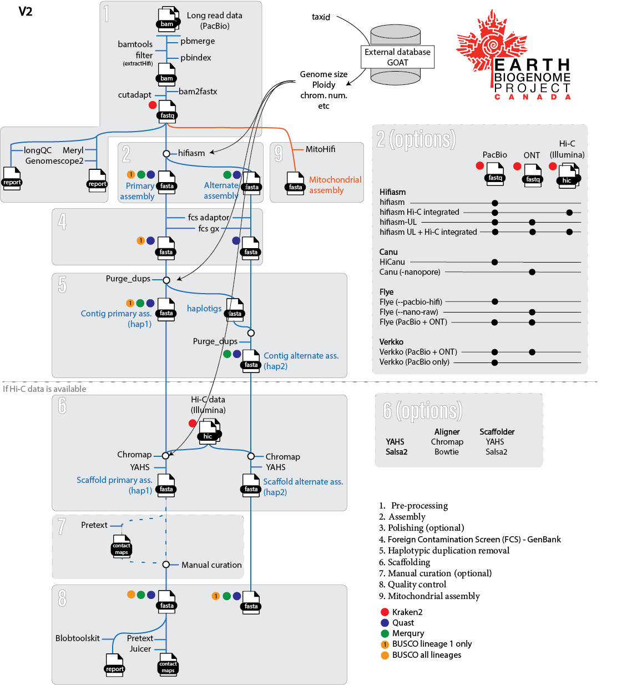

# CBP Genome Assembly pipeline
This pipeline is used by the [Canadian Biogenome project](http://earthbiogenome.ca) to generate genome assemblies from a variety of species.

The pipeline is built using [nextflow](https://www.nextflow.io/).

In short, each step of the pipeline is included in a module. Most of the modules uses one container which makes it much easier to maintain and update software dependencies. **Some modules rely on locally installed tools**. Future updates of the pipeline may include better portability.

A lot of the modules available in this pipeline were developed by members of the nf-core/genomeassembler group, if you want to participate, feel free to join the community.

## **Table of Contents**
* **[Input data](#input-data)**
* **[Output data](#output-files)**
* **[Process](#process)**
  * [Running the pipeline with test data](#running-the-pipeline-with-test-data)
  * [Running the pipeline with your own data](#running-the-pipeline-with-your-own-data)
* **[Credits](#credits)**
* **[Details on the test dataset](#details-on-the-test-dataset)**


## **Input data**
The pipeline was developped to take as input PacBio ccs files (bam) and Hi-C files (fastq.gz). The pipeline also support the inclusion of nanopore data and short-reads for polishing.

The pipeline also require the specie [Taxonomy ID](https://en.wikipedia.org/wiki/Help:Taxon_identifiers#:~:text=Taxon%20identifiers%20are%20identifiers%20assigned,reference%20for%20each%20catalogued%20taxon.) in order to query [GoaT database](https://goat.genomehubs.org) and retrieve additional information on the specie such as the scientific name, the ploidy or the genome size.

You can find the taxonomic id of your specie of interest on NCBI.
For example, the taxonoic ID for the Steller Sea Lion is 34886 [NCBI link](https://www.ncbi.nlm.nih.gov/Taxonomy/Browser/wwwtax.cgi?id=34886)


## **Output files**
The pipeline generates many files and intermediate files, most are self explanatory. 


## **Process**
An overview of the pipeline is visible on the following subway map. Some parts of the pipeline have been commented out as they relied on locaaly installed software. The code is still available in case you also want to locally install the software and use them for the assembly generation / evaluation.

By default, the pipeline will use hifiasm with PacBio data for the assembly, and if Hi-C data is available, YAHS is used for the scaffolding.
Other assembler and scaffolder are available within the pipeline, to change, you need to edit the nextflow.config file.


<p align="center">
    
</p>
<p align="center">
Figure : Overview of the Canadian Biogenome project assembly pipeline
</p>


## Running the pipeline with test data
To run this pipeline, you need [nextflow](https://www.nextflow.io/docs/latest/getstarted.html) and [conda](https://docs.conda.io/projects/conda/en/latest/commands/install.html) installed on your system.

A set of test data are available in this repo to allow you to test the pipeline with just one command line:

```
nextflow run bcgsc/Canadian_Biogenome_Project -r V2 -latest -profile conda
```

The outputs are organized in several subfolder that are self-explenatory.


## Running the pipeline with your own data
### Clone the repository in your local environment:

```
git clone https://github.com/bcgsc/Canadian_Biogenome_Project.git
cd Canadian_Biogenome_Project
```

### Modify the nextflow.config file:

IMPORTANT : In the nextflow config file, to comment out a line, the type is : // (instead of # in bash scripts) - [More details](https://groovy-lang.org/syntax.html#:~:text=Single%2Dline%20comments%20start%20with,considered%20part%20of%20the%20comment.)

- Indicate the specie ID (ex : "Steller_sea_lion_001) and the specie taxonomy ID (ex : 34886)
  
The specie ID will be used as a prefix to name some of the output file, it as to be a string.

More details to identify the taxonomy ID are available [here](#Input-data)

For details regarding the 'related_genome' optional parameter, see below in optional additional steps of the pipeline
```
//Specie parameters
        id                      = "Steller_sea_lion_001"
        taxon_taxid             = "34886"
//	related_genome		= "GCA_009762305.2"
	string_telomere		= "TTAGGG"
        pipeline_version        = "V2"
```


- Indicate the location and filenames of the input files (PacBio data, Hi-C data, etc)
  
For PacBio data, [unlaigned bam files](https://pacbiofileformats.readthedocs.io/en/11.0/BAM.html#:~:text=Unaligned%20PacBio%20BAM%20files%20shall,a%20ZMW%2C%20numerically%20by%20qStart%20.) are expected.

Reads from the [CCS PacBio technology](https://ccs.how) are expected, if other reads are used, indicate it with the 'pacbio_input_type' parameter and use another aligner in the method section to generate the assembly (hifiasm, the default assembler in this pipeline, is designed for [HiFi reads](https://www.pacb.com/blog/the-hifi-difference-large-scale-high-quality-data-for-all-of-us/)).

If you have several PacBio SMRT cells for one specie, you can indicate them all (up to 4). No need to merge the data prior to launching the pipeline.

For Hi-C reads, Illumina paired-end data are expected (fastq.gz) - [More details](https://www.illumina.com/science/sequencing-method-explorer/kits-and-arrays/hi-c-3c-seq-capture-c.html)
```
//PacBio input
	pacbio_input_type	= "ccs" //'ccs' or 'clr' or 'subreads'
	bam_cell1		= "$baseDir/example_input/subset_covid_hifi.bam"
//      bam_cell2               = "${raw_data_path}/pacbio/"

//HiC Illumina input
        hic_read1               = "$baseDir/example_input/test_1.fastq.gz"
        hic_read2               = "$baseDir/example_input/test_2.fastq.gz"
        Illumina_prefix         = "test"
```

- (Optional) As the pipeline relies on hifiasm by default, only reads with rq>0.99 (≥Q20 (HiFi reads only, Probability of incorrect base call : 1 in 100), equivalent of using extracthifi software) are used.

If you want to filter more or less read, you can change the read quality threashold in the nextflow.config file:
```
        pacbio_rq               = "0.99"
```

- (Optional) Indicate the BUSCO lineage or lineages that BUSCO should use to assess the completness of the assembly.

If no lineage are indicated (if the lines are comented out as in the below example), BUSCO will be set to [auto-lineage](https://busco.ezlab.org/busco_userguide.html#automated-lineage-selection)

If you indiciate a specific lineage, this lineage needs to be [downloaded](https://busco.ezlab.org/busco_userguide.html#offline) and located in the path section under 'busco_lineages_path' in nextflow.config file
```
//Optional (if not indicated, autolineage for busco)
//        lineage                 = ""
//        lineage2                = "vertebrata_odb10"
//        lineage3                = "metazoa_odb10"
//        lineage4                = "eukaryota_odb10"
```

- (Optional) Include additional dataset (nanopore data such as ultra-long reads or long reads; Illumina short read data for polishing)

By default, this pipeline relies on PacBio HiFi reads and Hi-C data only. In some cases, nanopore data may be generated, in which case, polishing using Illumina short-read may be preferable. If such approach is done, you can indicate the nanopore and Illumina short-read data in this section
```
//ONT input
//	ont_fastq_1		= "${raw_data_path}/nanopore/"

//Illumina short reads input
//	illumina_SR_read1	= "${raw_data_path}/SR/"
//	illumina_SR_read2	= "${raw_data_path}/SR/"
```


- (Optional) To use another assembler than hifiasm, modify the method section in the nextflow.config file (Details indiacted in the nextflow.config file)
```
//Method
        assembly_method         = "hifiasm"	// 'hifiasm' or 'canu' of 'flye' or 'verkko'
	assembly_secondary_mode	= "pacbio"	// Depends on the assembly method selected, details in the following lines :
// With hifiasm : 'pacbio' (uses pacbio data only), 'pacbio+hic' (--h1 //--h2 : include Hi-C integration, requires Hi-C reads, VGP says that the output requires additional manual curation), 'pacbio+ont' (--ul : Ultra-long ONT integration), 'pacbio+ont+hic'
// With canu : 'hicanu' (-pacbio-hifi : uses HiFi data only), 'ont' (-nanopore : uses nanopore data only), 'clr' (-pacbio : for clr reads (lower quality than hifi))
// With flye : 'hifi' (--pacbio-hifi mode), 'ont' (--nano-raw mode), 'pacbio+ont', 'clr' (--pacbio-raw)
// With verkko : 'pacbio' (--hifi: uses HiFi data only), 'ont' (--nano : uses nanopore data only), 'pacbio+ont' (--hifi --nano)
	polishing_method	= "none"	// 'pilon' or 'none'
	purging_method		= "purge_dups"	// "purge_dups" or "no"
	scaffolding_method	= "yahs"	// 'yahs' or 'salsa'
```

- (Optional) If you want to run additional steps of the pipeline.
  
Most of the following steps have been set to 'no' by default as they require local installation of tools or databases.
```
//Optional steps
	mitohifi		= "no"		// 'yes' or 'no' - Geneerate the mitochondrial assembly
	execute_kraken		= "no"		// 'yes' or 'no' - Assigning taxonomic labels to short DNA sequences
	fcs			= "no"		// 'yes' or 'no' - Foreign contamination screening
	methylation_calling	= "no"		// 'yes' or 'no'
	juicer			= "no"		// 'yes' or 'no' - HiC contact map
	genome_comparison	= "no"		// 'yes' or 'no' - Jupiter plots using circos
	pretext			= "no"		// 'yes' or 'no' - HiC contact map
	blobtools		= "no"		// 'yes' or 'no' - Overview of data quality
	manual_curation		= "no"		// 'yes' or 'no' - This parameter doesn't change the pipeline, it is only used to track which assemblies have been manually curated
```

_mitohifi_ : Geneerate the mitochondrial assembly using [mitohifi](https://github.com/marcelauliano/MitoHi

To run mitohifi, it is required to include your email address in the path section under 'email_adress' and download a local version of MitoHifi (mitohifi.py that should be located in ${params.singularity_cache}/MitoHiFi/mitohifi.py)

(This may be updated in the future if conda / singularity containers are generated and stable).

_execute_kraken_ : Assigning taxonomic labels to short DNA sequences with [Kraken2](https://github.com/DerrickWood/kraken2)

Kraken2 requires [downloading and setting up specific databases](https://github.com/DerrickWood/kraken2/blob/master/docs/MANUAL.markdown#kraken-2-databases). If you have the expected databases in your system, indicate the path in the path section under 'kraken_db'

_fcs_ : [Foreign contamination screening](https://github.com/ncbi/fcs) from NCBI.

The NCBI Foreign Contamination Screen (FCS) is a tool suite for identifying and removing contaminant sequences in genome assemblies. Contaminants are defined as sequences in a dataset that do not originate from the biological source organism and can arise from a variety of environmental and laboratory sources. FCS will help you remove contaminants from genomes before submission to GenBank.

FCS_GX requires [downloading a database](https://github.com/ncbi/fcs/wiki/FCS-GX#b-download-the-database). If you have such database in your system, you can indicate the path in the path section under 'fcs_gx_database'

_methylation_calling_ : Using PacBio HiFi reads with kinetics, it is possible to [identify epigenetic marks in the ssequence](https://www.pacb.com/products-and-services/applications/epigenetics/). This is done using [jasmine](https://github.com/PacificBiosciences/jasmine).

This is commented out as the test PacBio dataset do not include kinetics.

_juicer_ : [Platform](https://github.com/aidenlab/juicer) for analyzing kilobase resolution Hi-C data

The command line version of Juicer requires a [jar file](https://github.com/aidenlab/juicer#command-line-tools-usage) that needs to be downloaded locally. If you have juicer_tools.jar installed on your system, you can include the path to the jar file in the path section under 'JUICER_JAR'.

_genome_comparison_ : Generates a [Jupiter plot](https://github.com/JustinChu/JupiterPlot) to compare the obtained assembly to the assembly of a closely related specie using [Circos](http://circos.ca).

This only works for high-quality scaffold assemble (high scaffold N50, low number of scaffolds).

The GenBank assembly number of the closely related specie to compare the generated assembly must be indicated in the Specie parameter (top of the nextflow.config file), under 'related_genome'

For example, if we wanted to compare to the [California sea lion](https://www.ncbi.nlm.nih.gov/datasets/genome/GCF_009762305.2/), we would indicate "GCA_009762305.2" and remove the // that comment out this information.

_pretext_ : [Converts SAM or pairs formatted read pairs into genome contact maps](https://github.com/wtsi-hpag/PretextMap).

_blobtools_ : [BlobTools2](https://github.com/blobtoolkit/blobtoolkit) is a command line tool designed to aid genome assembly QC and contaminant/cobiont detection and filtering.

Blobtools2 is a great tool but a bit complex to install locally. It requires database, and a specific data structure. I automated most of it to obtain the [good looking plots](https://blobtoolkit.genomehubs.org/btk-viewer/viewer-tutorials/exploring-views/) (snails, blob and cumulative).

The Darwin Tree of Life is working on a [nextflow version of this tool](https://github.com/sanger-tol/blobtoolkit).

_manual_curation_ : This doesn't actually do a thing. It is just used to track which assemblies were manually curated and which were not.

- (Optional) Modify the path
```
//Path 
        scratch_dir		= "<path>"
        outdir                  = "${scratch_dir}/${id}/${pipeline_version}/"
        busco_lineages_path     = "${scratch_dir}/busco_downloads/"
	kraken_db		= "${scratch_dir}/kraken-db/"
	singularity_cache	= "${scratch_dir}/singularity/"
        JUICER_JAR              = "${singularity_cache}/juicer_tools_1.22.01.jar"
	Blobtoolkit_db		= "<path>/BlobtoolkitDatabase/"
	blobtoolkit_path	= "${scratch_dir}/blobtoolkit"
	modules_path		= "${scratch_dir}/pipeline/modules/"
	email_adress		= "<email_address>"
	fcs_gx_database		= "${scratch_dir}/fcs_gx/gxdb/all"
```


Launch the pipeline

```
nextflow run main.nf -profile singularity
```


## **Credits**

The pipeline was originnally written by [@scorreard](https://github.com/scorreard) with the help and input from :

- Members of the Jones lab (Canada's Michael Smith Genome Sciences Centre, Vancouver, Canada).

	- Special thanks to [@Glenn Chang](https://github.com/Glenn032787) for reviewing that repo.

- Members of the Earth Biogenome Project and other affiliated projects.
- Members of the nf-core / nextflow community.


## **Details on the test dataset**

The PacBio data is a subset of covid sequences obtained with this command lines :

```
wget https://downloads.pacbcloud.com/public/dataset/HiFiViral/Jan_2022/m64187e_211217_130958.hifi_reads.bam
samtools view -b m64187e_211217_130958.hifi_reads.bam -s 123.001 > subset_covid_hifi.bam
```

The Hi-C data was downloaded from one of the nf-core test dataset

```
wget https://github.com/nf-core/test-datasets/blob/modules/data/genomics/sarscov2/illumina/fastq/test_1.fastq.gz?raw=true
wget https://github.com/nf-core/test-datasets/blob/modules/data/genomics/sarscov2/illumina/fastq/test_2.fastq.gz?raw=true
```
